# Super-attention for exemplar-based interactive image colorization

The project is part of the ANR PostProdLEAP project which focuses on the restoration and colorization of archival
restoration and colorization of archival images and videos. As part of his thesis, Hernan Carrillo has developed
a deep learning method to guide the colorization of a grayscale image with a color image provided by a
with a color image provided by a user.

## Presentation of the existing project
_Figure1_
<p align = 'center'>

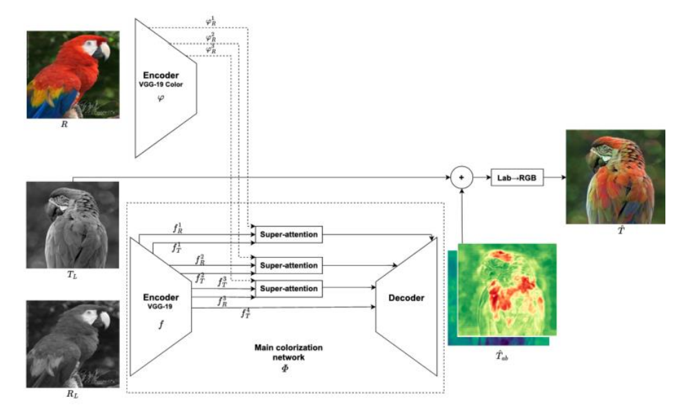
</p>

Diagram of the image colorization method. The method consists of two main parts: 1) the color feature extractor $\varphi$ which extracts multi-level feature maps from a reference color image, and 2) the main colorization network $\Phi$, which learns to match a $T_L$ luminance image to its $T_{ab}$ chrominance channels given the reference color image $R$. This colorization guidance is performed by superattention modules, which learn superpixel-based attention maps from the target and reference feature maps from separate levels.
## Objectives
The objective of this PFE is to add a segmentation map to the input of the network in order to guide guide the colorization more precisely. For example, if the example image in Figure 1 contained a parrot and another animal, only the colors of the parrot should be used to guide the colorization.
The idea is to allow the attention layers to integrate the colorization. In a first step, we will try to understand and if necessary improve the code of the first method. Then, the addition of a segmentation map will be studied.

Content:

- `main.py` : Init dataset and dataloader, model, training or testing procedure.
- `training.py` and `testing.py`: training resize 224 with batch=8 and testing.py (inference batch= 1).
- `utils.py`: useful functions that allow this work
- `data.py`: Definition of two custom datasets, one for training, the other for test (inference).
- `data/analogies/` : This is for training. it contains two matrices of similarities between target and references images.
- `runs/` : folder where the training log is saved (tensorboard is used)
- `samples/`: It contains some test images if you want to try the model. accv and unicolor_img folders have a target (grayscale images) and ref (color images) subfolder.

`models.py`: Encoder for extracting reference color features (pre-trained VGG-19) and Variant of the network used for ACCV paper, with super-attention on each encoder block. (Better results w.r.t skip connection one)

## External data

Download `data.tgz` and `models.tgz` from this link:
https://ubcloud.u-bordeaux.fr/s/xDiGzdCaBj2wibw
Password: S2nEmTqyJo

Extract both archives at the root of the repository.

## Requirements

`pip install -r requirements.txt`

## Usage
All arguments are `optional` for the moment.

### Launching the colorisation
`main.py` : this is the initial file for launching the colorization in test mode by default.
```bash
python main.py
```

However, there is an option that allows us to save the attention maps.
It goes as it follows:
```bash
python main.py --save_attention_maps
```

The result will then be available in this directory: `~/pfe_color_superattention_master/results/super_attent_v1_res_conection/unicolor_img/epoch35/` for the colorized data, and in this one: `~/pfe_color_superattention_master/results/super_attent_v1_res_conection/unicolor_img/epoch35/attention_maps/` for the attention maps of each image.

## First results
### Colorized images
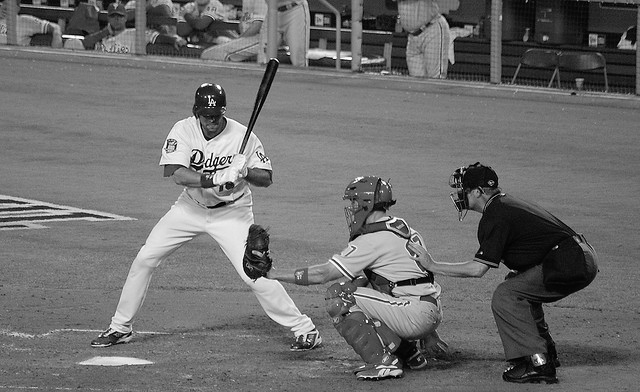  |  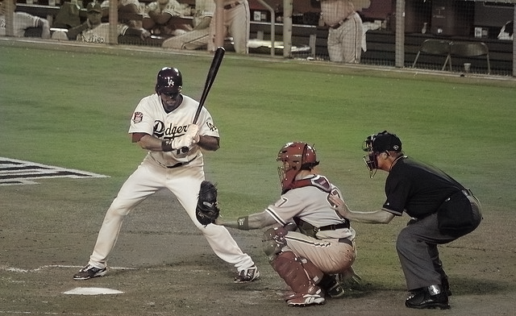  |
:-------------------------:|:-------------------------:| 
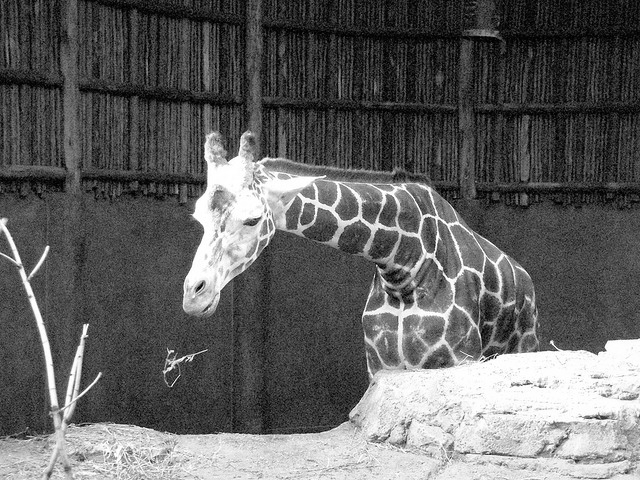  |  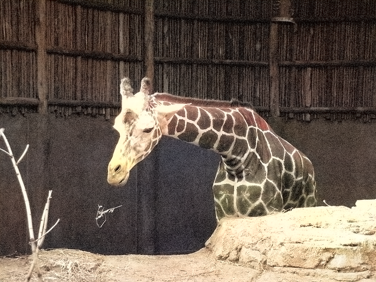 |
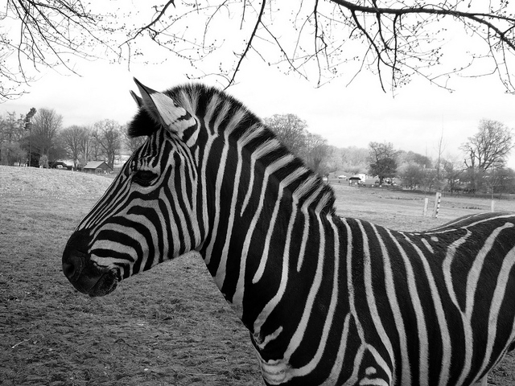  |  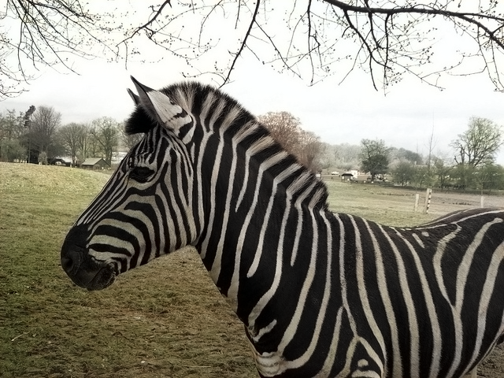 |
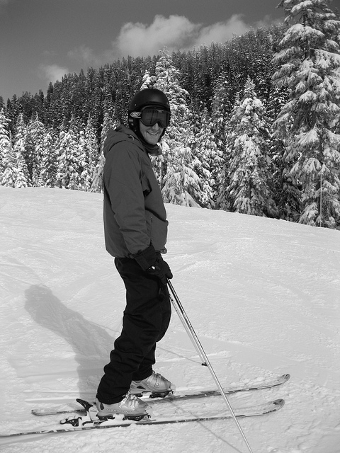  |  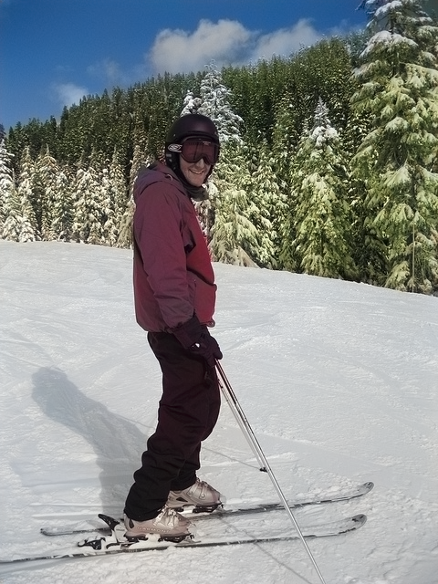 |

#### Attention maps of the first image
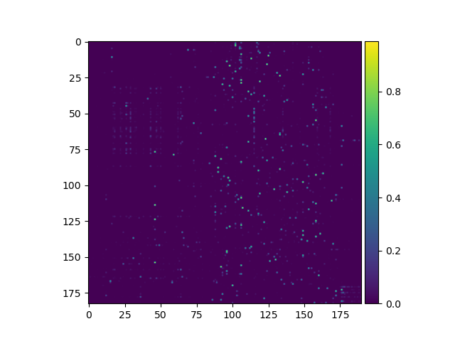  |  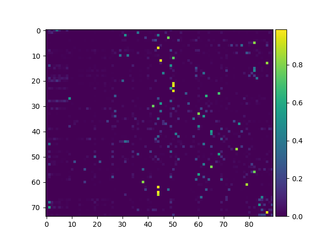  |
:-------------------------:|:-------------------------:| 
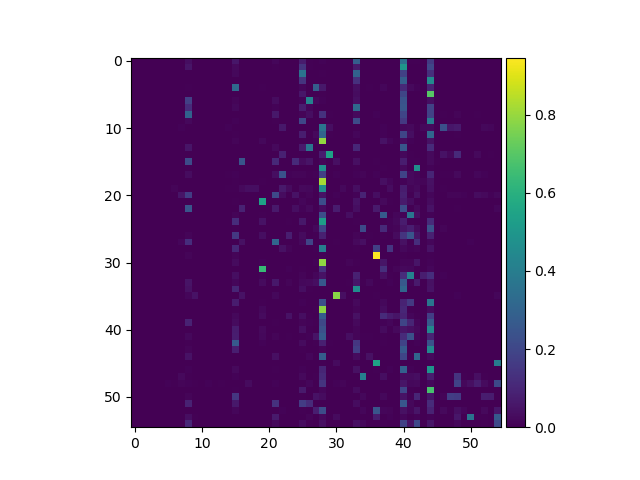  |  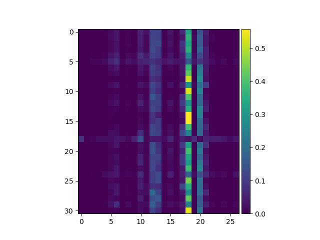 |


